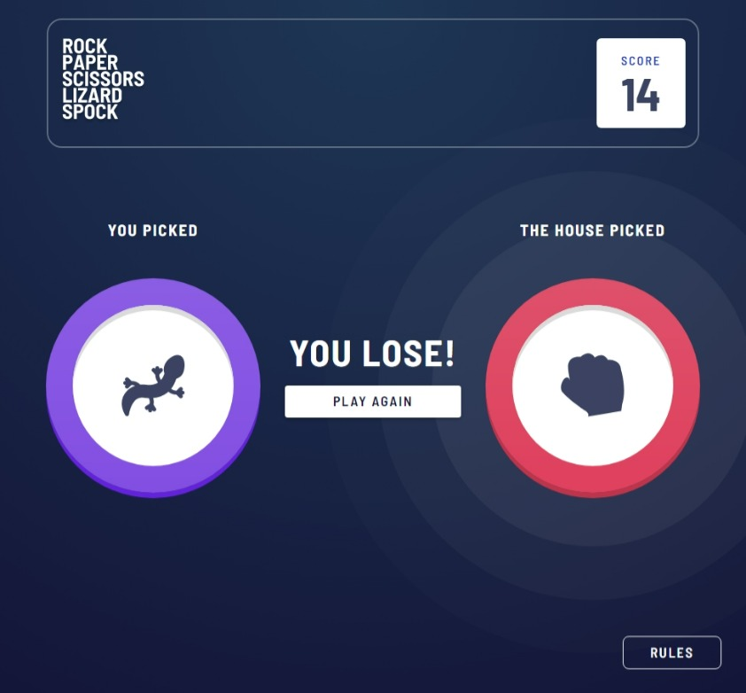

# Frontend Mentor - Rock, Paper, Scissors solution

This is a solution to the [Rock, Paper, Scissors challenge on Frontend Mentor](https://www.frontendmentor.io/challenges/rock-paper-scissors-game-pTgwgvgH). Frontend Mentor challenges help you improve your coding skills by building realistic projects.

## Table of contents

- [Overview](#overview)
  - [The challenge](#the-challenge)
  - [Screenshot](#screenshot)
  - [Links](#links)
- [My process](#my-process)
  - [Built with](#built-with)
  - [What I learned](#what-i-learned)
  - [Continued development](#continued-development)
  - [Useful resources](#useful-resources)
- [Author](#author)

## Overview

### The challenge

Users should be able to:

- View the optimal layout for the game depending on their device's screen size
- Play Rock, Paper, Scissors against the computer
- Maintain the state of the score after refreshing the browser _(optional)_
- **Bonus**: Play Rock, Paper, Scissors, Lizard, Spock against the computer _(optional)_

### Screenshot



### Links

- Solution URL: [Solution](https://www.frontendmentor.io/solutions/desktopmobile-solution-using-react-and-material-ui-rywlGOafq)
- Live Site URL: [App](https://webguy83.github.io/rock-paper-scissors/)

## My process

### Built with

- [React](https://reactjs.org/) - JS library
- [Material UI](https://mui.com/) - For styles/custom components/theming

### What I learned

I took this opportunity to get a firm grasp of the Material UI framework as it has a lot of cool new features that were recently added to the latest version. Custom theming and integration of breakpoints for responsive behaviour was the biggest challenge for me. Some interesting features that really saved time were using the prebuilt Modal component in MUI, which made adding the Rules component very easy and saved a ton of time.

#####MUI Modal component configurations used:

```html
<Modal aria-labelledby='rules-modal-title' aria-describedby='rules-modal-description' open={open}
onClose={handleClose} closeAfterTransition BackdropComponent={Backdrop} BackdropProps={{ timeout:
500, }} >
```

This made creating the backdrop and popup very simple and straight forward. No need to add extra JS logic for opening and closing the modal. Most of it is already done by MUI.

#####Custom theming for the Rules button:

```js
import Button from '@mui/material/Button';
import { styled } from '@mui/material/styles';

export default styled(Button)(({ theme }) => ({
  color: theme.palette.background.paper,
  borderColor: theme.palette.background.paper,
  borderRadius: 8,
  padding: theme.spacing(0.625, 4.375),
  fontSize: 18,
  letterSpacing: 2,
  '&:hover': {
    borderColor: theme.palette.background.paper,
    backgroundColor: 'transparent',
  },
}));
```

The above example uses a MUI **styled** function to allow the user to custom style a MUI pre-made component to the user's liking. It's nice to be able to mix the CSS in with the JS. This allows us to use the Material UI's theme object which has many properties of everything from spacing, breakpoints, font sizes, and so much more. Understanding this takes a lot of time, although with good CSS knowledge, it isn't too bad.

#####An example of breakpoints:

```js
const pickedStyles = (theme) => ({
  position: 'relative',
  zIndex: 10,
  display: 'flex',
  flexDirection: 'column',
  alignItems: 'center',
  margin: theme.spacing(0, 2),
  [theme.breakpoints.up('sm')]: {
    margin: theme.spacing(0, 4),
  },
});
```

The line [theme.breakpoints.up('sm')] basically replaces the need to make old fashioned media queries.

### Continued development

I would like to get more involved in creating custom themes/components in MUI. This framework takes a lot of effort to master.

### Useful resources

- [Material UI docs](https://mui.com/) - As usual the best resources for Material UI is the single source of truth. 99% of the help I needed was here.
- [Forwarding Refs in React](https://reactjs.org/docs/forwarding-refs.html) - Had to use this feature for the first time when using the Fade component in MUI. Props need to be passed down to the components children in this rare case.

## Author

- Github - [webguy83](https://github.com/webguy83)
- Frontend Mentor - [@webguy83](https://www.frontendmentor.io/profile/webguy83)
- Instagram - [@canadianwebdev83](https://www.instagram.com/canadianwebdev83/)
